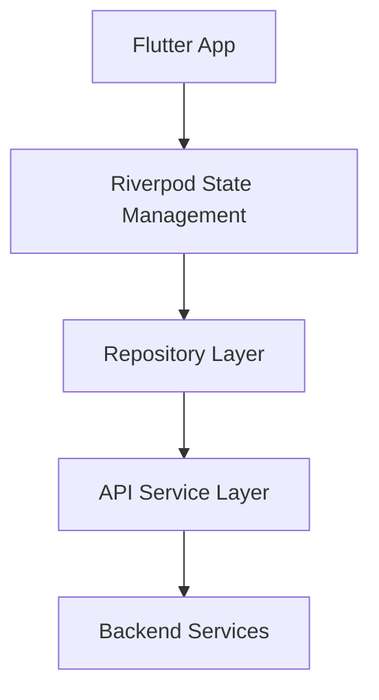

# Technical Documentation

## Table of Contents
1. [High-Level Architecture](#high-level-architecture)
2. [Core Components](#core-components)
3. [State Management](#state-management)
4. [Networking](#networking)
5. [Map Integration](#map-integration)
6. [Storage](#storage)
7. [UI Components](#ui-components)
8. [Unit Testing](#unit-testing)
9. [Router](#router)

### High-Level Architecture

### Core Components
1. **Presentation Layer**
    - Home Screen
    - Message Screen
    - Installation Screen
    - Login Screen

2. **Business Logic Layer**
    - Chat Notifier
    - Device Provider
    - Login Provider

3. **Data Layer**
    - API Client (Dio)
    - Local Storage
    - WebSocket Client (Centrifuge)

### State Management
- Riverpod
- Hooks Riverpod
- Flutter Hooks

### Networking
- Dio for REST API
- Centrifuge for WebSocket
- Alice for API debugging

### Map Integration
- Universe package
- OpenStreetMap

### Storage
- Get Storage

### UI Components
- GetWidget
- Tailwind Colors

### Unit Testing
- Mockito

### Router
- Go Router